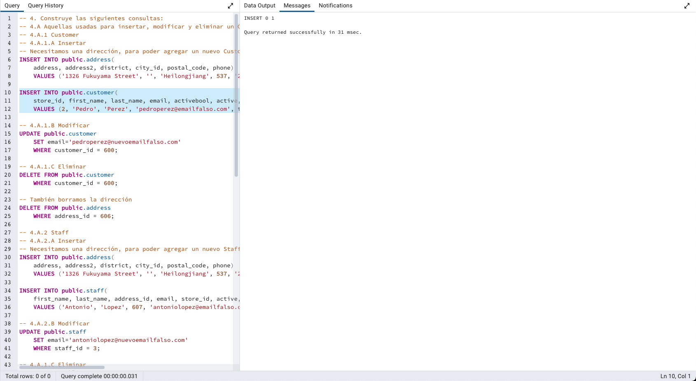
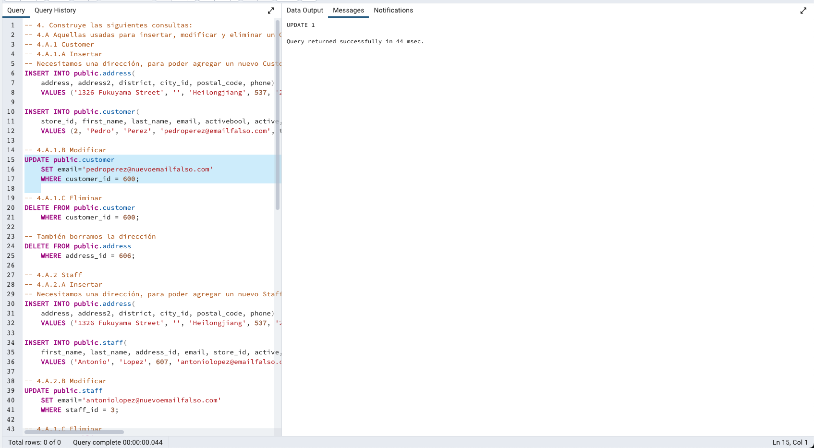
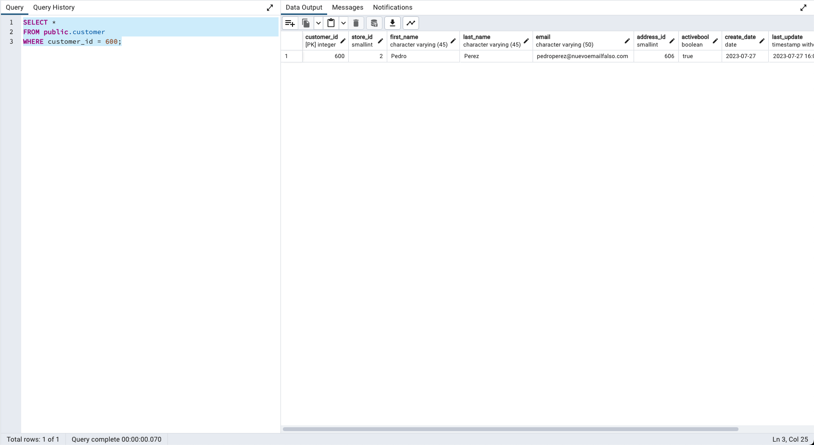
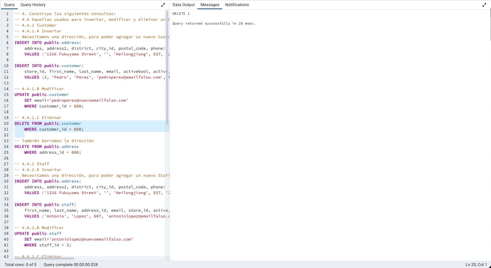
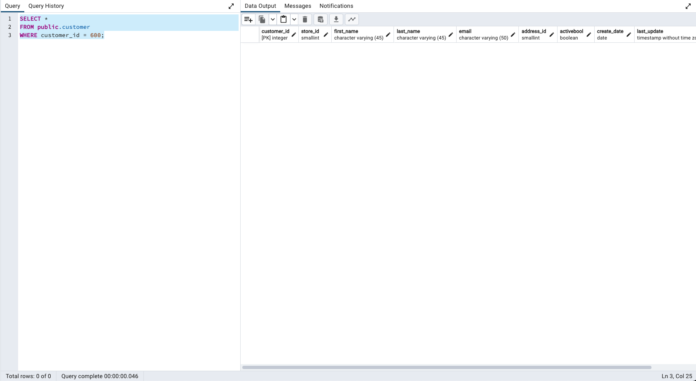
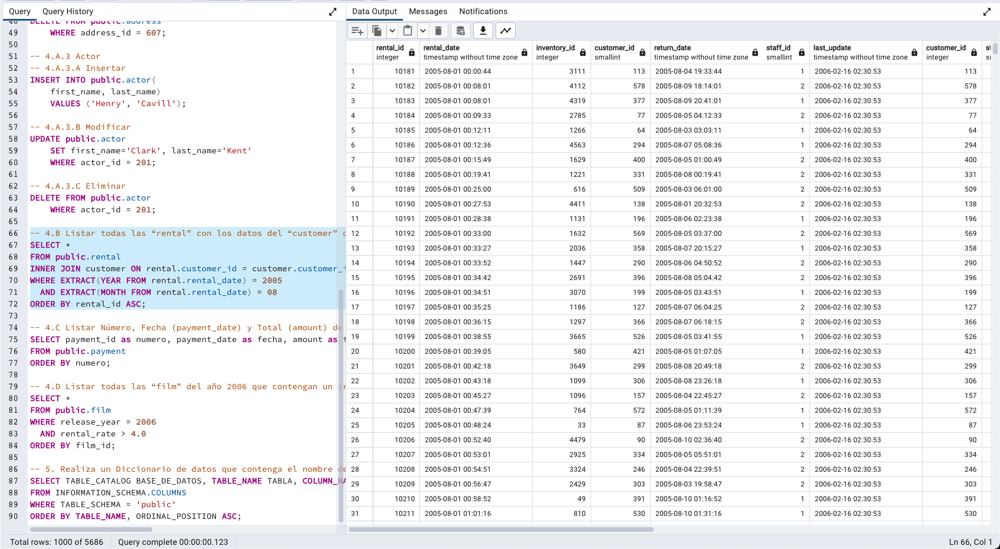
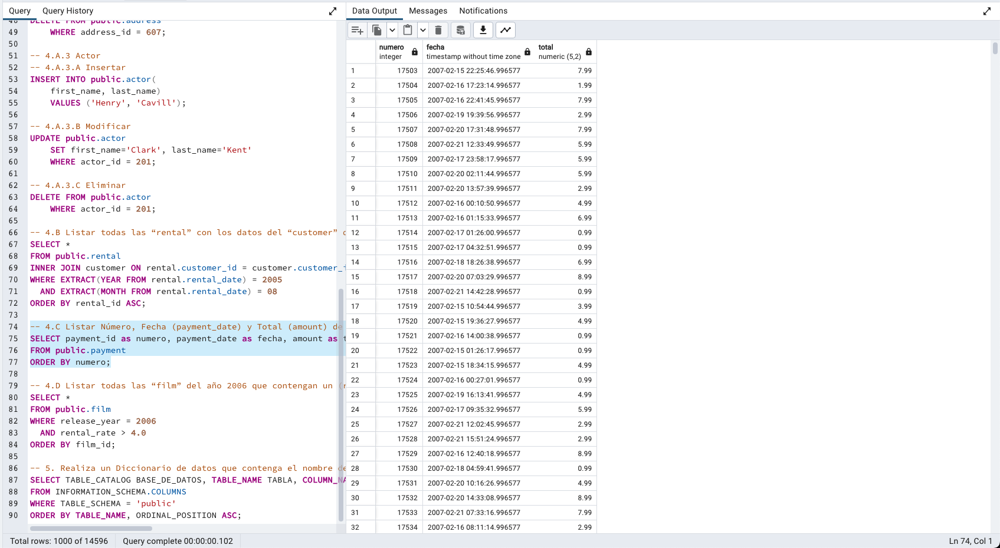
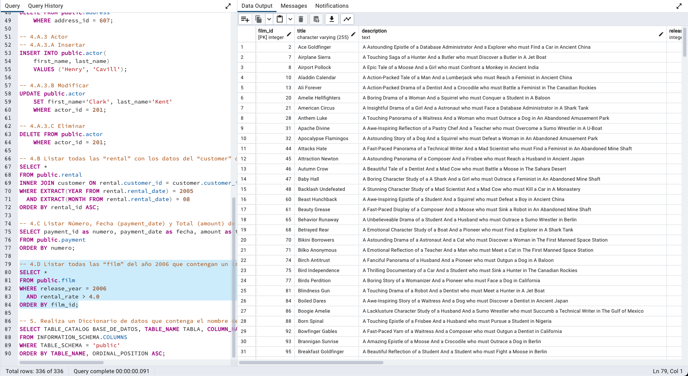
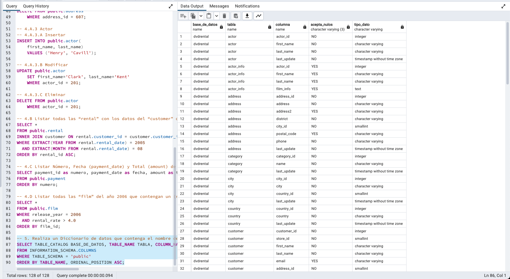

# Final Drilling

- Para poder ejecutar estas consultas tome en cuenta que debe cargar la BD `dvdrental`. La puede conseguir en: https://www.postgresqltutorial.com/postgresql-getting-started/load-postgresql-sample-database/

- Una vez tenga la BD puede ejecutar los archivos que consigue en el archivo `final_drilling.sql`

- Tambien puede ver los resultados de la mayoria de las consultas en la carpeta consultas:

  - Aquellas usadas para insertar, modificar y eliminar un Customer(Staff y Actor no se tomaron capturas de pantalla por ser similares, pero las consultas asociadas estan en el archivo de consultas `final_drilling.sql`)

    - Insertar Customer 
    - Insertar Customer - Resultado 
    - Modificar Customer 
    - Modificar Customer - Resultado 
    - Eliminar Customer 
    - Eliminar Customer - Resultado 

  - Listar todas las “rental” con los datos del “customer” dado un año y mes. 
  - Listar Número, Fecha (payment_date) y Total (amount) de todas las “payment”. 
  - Listar todas las “film” del año 2006 que contengan un (rental_rate) mayor a 4.0. 
  - Realiza un Diccionario de datos que contenga el nombre de las tablas y columnas, si éstas pueden ser nulas, y su tipo de dato correspondiente. 
